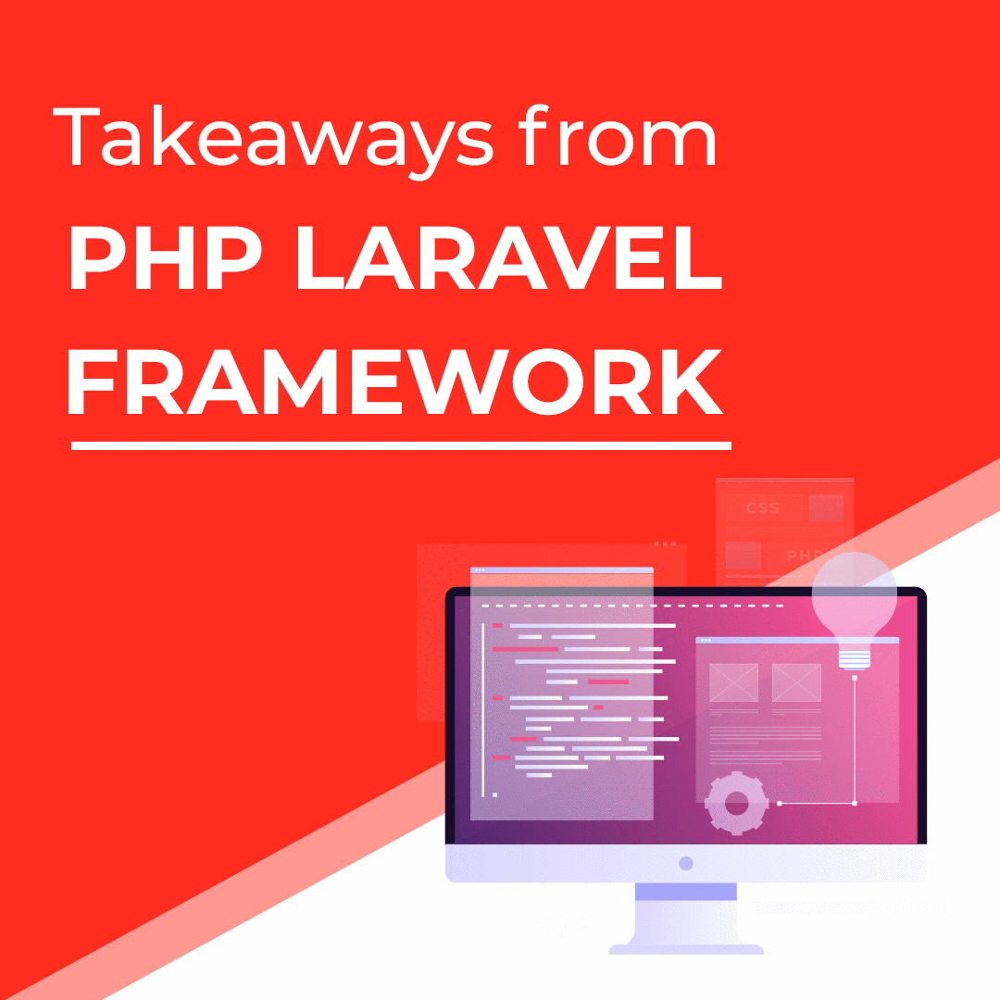

# Laravel
All my Laravel learnings, experiments and projects are available in this repository.

# Important Notes for Laravel

## Installation
To install Laravel, the following is required:
1. First Install the PHP (You can install php from xampp or lampp, if you want the additional server that is good).
2. Download and install the Composer
	- The **Composer** can be defined as a dependency manager or package manager that allows the developer to install the dependencies for the project.
        - This utility is like pip for python, npm for node etc.
3. Download the laravel installer
	- **CMD:** **composer** global require laravel/installer
4. To create a new Project
	- **CMD:** laravel new [project_name] optional_params [--dev]

## Artisan
Artisan is a tool that is used when the laravel is installed, in simple, when we create any project in laravel, this is the command line system for the laravel project. There are couple of commands that can help you in the laravel project, few of the examples are as under:
1. php artisan
	- This **command** is used to check the commands that we can execute with the artisan in laravel project.
2. php artisan serve
	- This **command** is used to run the php project. And you will see the link for the running server, it means that you don't need the xampp server in order to run this project.
3. php artisan --version
	- This **command** is used to check the version of the laravel.

## Route
Routing is used in laravel to map our requests with parameters. It is a flexible to for the client to interact with our controllers and is also a convinient one to one way to return the view or any string response against the request from the client.

## Blade Template
It is a teplate engine introduced in **Laravel 5.1**. This template engine allows us to reuse the template to other views and also does not restrict the user to use plain php like in core to the blade template. The template is cached until it is modified.

## composer.json
This file contains all the configurations when creating the project. And you can see each configuration or any library included is stored in the vendor file. 

## Vendor Folder
It includes all the dependencies added by the composer in this directory. You can see all the configuration in the composer.json file and every configuration there is added in the vendor folder by composer. 

## .env
This is the **environmental configuration**. This is where all your database credentials and the server configuration is done. And when you deploy the project live, you can change the credentials as per the server and the database or other configurations as well.

## Controller and Model Overview
The **app** directory that is in the root contains our controllers and models. We can easily create our models and controllers using the artisan commands and here i'll describe for now the command for making the controller.

> php artisan make:controller [controller_name]

To connect to the **controller**, you'll need to call from the route, and when you do that there is a difference that i've noted in the projects, so type difference is the version one.
> Old Version: [ControllerName]e@[functionname]
> New Version: [[ControllerName]:class, '[functionname]']

## Migrations
It is like a version control system in laravel that updates the database based on the ORM Objects to which are migrations created. You can see the changes in the database.
> You can configure the database credentials in the .env file in the root of the project.

## What are Facades in Laravel?
It is a namespace in Laravel that provides the support of the underlying classes. You can find many classes in the facades namespaces that acts as a helper classes in the project to perform the specific tasks.
## DB Class in Facades

The **DB class** extends facades that provides to perform operations with dataabase using both modes either in ORM or raw query.
> Raw: DB::insert('[query]', [bindings...])  
  Raw: DB::update('[query]', [bindings...])  
  Raw: DB::delete('[query]', [bindings...])  
  Raw: DB::select('[query]', [bindings...])  

The ORM Code for the CRUD to perform with the database:
> Insert User:  
  $user = new User();  
  $user->name = 'Osama';  
  $user->email = 'osamahu96@gmail.com';  
  $user->password = bcrypt('password');  
  $user->save(); 
  Now there is a point to note, that we have explicitly assigned the value to each property of the model, but it saves the data to the db. 
  **Bcrypt** algorithm used above is the encryption algorithm that hashes the given value given to the function. It is the utility provided by Laravel for encryption.

> To see all the data:  
  $users = User::all();  
  dd($users);  
  It fetches all the records from the db

> To update the record  
  User::where('id', 4)->update(['name' => 'Osama Ahmad']);
  It updates the specific row from the db.

> To record the record:  
  User::where('id', 2)->delete();  
  It deletes the specific row from the database

## Mass Assignment Security(Elaquent Feature)
   1. It is a security vunerablity that lets any user pass to any level of website, may provide query to database that do not match the schema of any table for instance. 
   2. To avoid the above problem, mass assignment fillable must be activated that lets the user pass only the allowed attributes so that user cannot send invalid values which may ultimately crashes teh wesbite.

## Accessors and Mutators
   As we know that every MVC Framework has common norms and Getters and Setters are one of them, though they are called in different terms as also in the world of Laravel it is called Accessors(Getters) and Mutators(Setters)
   
   > *** Mutators: *** This is the setter for to set any property inside the model and then perform operation on it, for instance to transform the value etc. So that we may perform appending final values in the database.
   > *** Accessors: *** This is the getter for to get any property value just like we return any model property.
   > ** Rules **: Mutator: set[Property Name]Attribute  <==> Accessor: get[Property Name]Attribute

## Install Laravel UI Package
There are many packages that can be installed by the following steps that are shown below but to best choose the example, i've choosen Laravel UI Package so that it'll be instnaciated to the composer.json file and will be added to the vendors directory.
   1. Use composer to install any require package
      - composer require laravel/ui
   2. Using artisan, we can make basic login and registration views with routes automatically instanciated for them.
      - php artisan ui:auth
   3. After preparing the full routed template of ui, we'll power these basic templates of login and registration with bootstrap theme using one of the following command.
      - php artisan ui bootstrap
   4. Finally, we need to perform some of the node commands as the finals steps to confirm the laravel ui packages in the project or to configure these in the php artisan environment.
      - npm install
      - npm run dev
   
    
   
   Note: To be curious, if you want to check the list of all the php artisan commands related to the packages you've thus installed.
       - php artisan listall

## Blade Template
It is a specific Laravel blade syntax in replacement of php code when writing the view code in .blade.php file. The benefit of using the .blade.php syntax is that it provides us the ability to write cleaner and understandable code. It also provides us clearner accessability of data using laravel blade alias and also we can we can write traditional php code.
